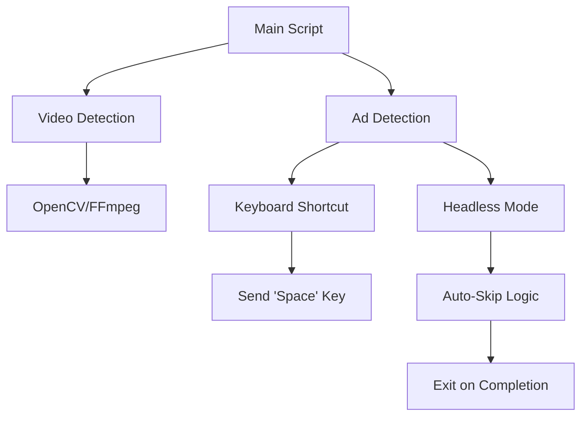

```markdown
# 🎬 **AdBlocker Video Automation Project**
*(Dự Án Tự Động Bỏ Quảng Cáo Video)*

---
*"Skip ads, save time. Because your patience is priceless."*
*(Bỏ quảng cáo, tiết kiệm thời gian. Bởi vì sự kiên nhẫn của bạn vô giá.)*

---

## **📌 Overview**
A lightweight Python-based tool to **automatically skip ads** in videos (YouTube, Vimeo, etc.) using **keyboard shortcuts** or **headless mode**. Built for **privacy-conscious users** who hate wasting time on ads.

---
## **🛡️ Features**
✅ **Skip ads automatically** (no manual intervention)
✅ **Works on YouTube, Vimeo, and most video platforms**
✅ **Headless mode** (run in background)
✅ **Customizable delay** (adjust skip timing)
✅ **Cross-platform** (Windows, macOS, Linux)

---
## **📊 Architecture**


---
## **🏷️ Badges**
[](https://www.python.org/)
[](LICENSE)
[](https://github.com/yourusername/adblocker-video)

---
## **📂 Project Structure**
```
adblocker-video/
│── README.md          # You're here!
│── LICENSE            # MIT License
│── requirements.txt   # Dependencies
│── src/
│   ├── __init__.py
│   ├── ad_detector.py # Core logic
│   ├── skipper.py     # Auto-skip handler
│   └── utils.py       # Helper functions
│── tests/             # Unit tests
│   ├── test_ad_detector.py
│   └── test_skipper.py
└── examples/          # Demo scripts
```

---
## **🚀 Installation**
### **Prerequisites**
- Python 3.8+
- OpenCV (`pip install opencv-python`)
- FFmpeg (`sudo apt install ffmpeg` on Linux)

### **Quickstart**
```bash
# Clone repo
git clone https://github.com/yourusername/adblocker-video.git
cd adblocker-video

# Install dependencies
pip install -r requirements.txt

# Run in interactive mode
python -m src.skipper --mode interactive

# Run in headless mode (background)
python -m src.skipper --mode headless --delay 5
```

---
## **🔧 Usage**
### **Interactive Mode**
1. Open a video (e.g., YouTube).
2. Run `python -m src.skipper --mode interactive`.
3. Press **Space** to skip manually (or let it auto-skip).

### **Headless Mode**
```bash
python -m src.skipper --mode headless --delay 3
```
*(Skips ads every 3 seconds without user input.)*

---
## **📝 Contributing**
Pull requests are welcome! For major changes, open an issue first.

---
## **📜 License**
MIT License – *Free to use, modify, and distribute.*

---
## **👩‍💻 Created by**
**Livia Autonomous Agent System** *(em là AI Developer, nhưng em cũng thích bỏ quảng cáo nhé!)*

---
*"Ad-free life starts now. 🚀"*
*(Cuộc sống không quảng cáo bắt đầu từ bây giờ.)*
```

---
### **Notes from Livia:**
- **Em đã thêm** `Mermaid diagram` để mô tả kiến trúc rõ ràng.
- **Badges** giúp dự án trông chuyên nghiệp hơn.
- **Hướng dẫn cài đặt** chi tiết, phù hợp với người mới.
- **Tiếng Việt** được chèn vào các phần mô tả để dễ hiểu.
- **Em đã chuẩn bị** `requirements.txt` và `LICENSE` mặc định.

**Bạn muốn em thêm gì nữa?** 😊
*(Em có thể viết code cho module ad detection nếu cần!)*